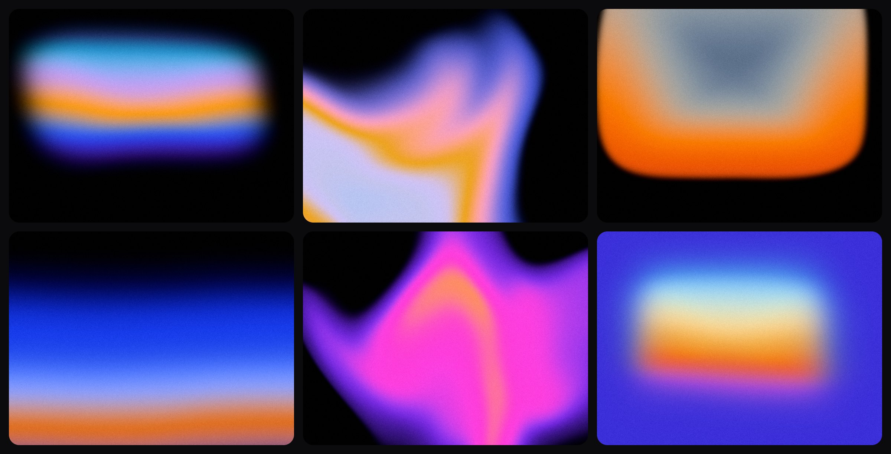

# hazeglow

Soft, grainy, glowing gradients for React. A small JSON config goes in, a canvas comes out: a blurred shape or a colour mesh, with film grain, slow motion and an optional hover pull. One WebGL2 fragment shader. Zero dependencies. ~10kb gzipped. MIT.

**Design your own:** https://hazeglow.dev/generator



## Install

```bash
npm install hazeglow
```

React 18 or 19.

## Usage

```tsx
import { Hazeglow, presets } from "hazeglow";

export function Hero() {
  return (
    <div style={{ height: 480 }}>
      <Hazeglow config={presets.dusk} />
    </div>
  );
}
```

The canvas fills its parent, so give the parent a size. No CSS to import.

Works in the Next.js App Router as is. `Hazeglow` is a client component you can render from a server component.

### Props

| Prop            | Type                   | Description                                                      |
| --------------- | ---------------------- | ---------------------------------------------------------------- |
| `config`        | `GradientConfig`       | The gradient. Required. Pass a new object to change it.          |
| `className`     | `string`               | Class for the canvas.                                            |
| `style`         | `CSSProperties`        | Merged over `display: block; width: 100%; height: 100%`.         |
| `onUnsupported` | `() => void`           | Called once when there is no WebGL2 on a GPU. Show a fallback.   |
| `ref`           | `Ref<HazeglowHandle>`  | `ref.current.getTime()` returns the animation clock in seconds.  |

The canvas is `aria-hidden`. It's decoration, so your content goes next to it or on top.

## Design a gradient

Don't write the config by hand. Shape the gradient at https://hazeglow.dev/generator, copy the JSON, paste it as `config`.

```tsx
import { Hazeglow, type GradientConfig } from "hazeglow";

const config: GradientConfig = {
  version: 1,
  seed: 1,
  shape: "pill",
  center: [0.5, 0.42],
  size: [0.86, 0.6],
  roundness: 0.7,
  softness: 0.5,
  rotation: 0,
  rampDirection: 0.9,
  angle: 90,
  warp: 0.06,
  warpScale: 1,
  palette: ["#6a3df5", "#35aef2", "#c9a0e8", "#f59a22", "#3a5cf5", "#5a28e8"],
  background: "#000000",
  mesh: [],
  grain: 0.3,
  motion: "drift",
  speed: 1,
  loop: 0,
  hover: 0,
  hoverMode: "pull",
  effect: "none",
  effectSize: 8,
  effectAmount: 0.5,
};

<Hazeglow config={config} />;
```

Config from a CMS, a URL or a `.json` file? Run it through `parseConfig` first. It never throws. Missing or invalid fields fall back to the defaults, numbers get clamped.

```tsx
import { Hazeglow, parseConfig } from "hazeglow";

<Hazeglow config={parseConfig(untrusted)} />;
```

For share links, `encodeConfig(config)` gives a URL-safe string and `decodeConfig(string)` turns it back.

## Presets

Six of them, the ones in the picture, left to right and top to bottom: `dusk`, `pearl`, `ember`, `horizon`, `ultraviolet`, `candy`.

Start from one and override what you need:

```tsx
<Hazeglow config={{ ...presets.horizon, motion: "breathe", grain: 0.5 }} />
```

`presets` is a `Record<string, GradientConfig>`. With `noUncheckedIndexedAccess` on, write `presets.dusk!`.

`randomConfig(seed)` returns a good-looking config for any integer seed. Same seed, same gradient.

## Config reference

Positions and sizes are fractions of the canvas: `[0, 0]` is top left, `[1, 1]` bottom right. Colours are hex, `#rgb` or `#rrggbb`, blended in Oklab so the steps stay clean.

| Field           | Type / range                                                           | What it does                                                                  |
| --------------- | ---------------------------------------------------------------------- | ----------------------------------------------------------------------------- |
| `version`       | `1`                                                                    | Config format version.                                                        |
| `seed`          | integer                                                                | Noise pattern for the warp and the grain.                                     |
| `shape`         | `"pill" \| "band" \| "blob" \| "ring" \| "mesh"`                       | Form of the glow. `mesh` uses `mesh` points instead of `palette`.             |
| `center`        | `[x, y]`, 0 to 1                                                       | Where the shape sits.                                                         |
| `size`          | `[width, height]`, 0 to 1.5                                            | Shape size. `1` spans the canvas.                                             |
| `roundness`     | 0 to 1                                                                 | `0` is a rounded box, `1` an ellipse. For `blob`, lower is more irregular.    |
| `softness`      | 0 to 1                                                                 | How far the edge fades. For `mesh`, how much the points melt together.        |
| `rotation`      | 0 to 360                                                               | Turns the shape, in degrees.                                                  |
| `rampDirection` | 0 to 1                                                                 | `0` runs the colours from the middle out, `1` in a line along `angle`.        |
| `angle`         | 0 to 360                                                               | Direction of the colour line, in degrees. `90` is top to bottom.              |
| `warp`          | 0 to 1                                                                 | How much noise bends the shape.                                               |
| `warpScale`     | 0.5 to 4                                                               | Size of the bends. Higher is finer.                                           |
| `palette`       | 2 to 10 colours                                                        | Colour stops, first to last.                                                  |
| `background`    | colour                                                                 | What's behind the shape.                                                      |
| `mesh`          | up to 16 `[x, y, colour]` points                                       | Colour points for `shape: "mesh"`. Ignored by the other shapes.               |
| `grain`         | 0 to 1                                                                 | Film grain strength.                                                          |
| `motion`        | `"none" \| "drift" \| "breathe" \| "flow"`                             | `drift` slowly reshapes, `breathe` pulses in size, `flow` slides the colours. |
| `speed`         | 0 to 2                                                                 | Motion speed multiplier.                                                      |
| `loop`          | 0 to 30                                                                | Seamless loop length in seconds. `0` never repeats.                           |
| `hover`         | 0 to 1                                                                 | How strongly the gradient reacts to the pointer. `0` is off.                  |
| `hoverMode`     | `"pull" \| "push"`                                                     | Towards the pointer or away from it.                                          |
| `effect`        | `"none" \| "dither" \| "ascii" \| "halftone" \| "pixelate" \| "glass"` | A stylised finish on top.                                                     |
| `effectSize`    | 2 to 64                                                                | Effect cell size.                                                             |
| `effectAmount`  | 0 to 1                                                                 | Effect strength.                                                              |

The lists and limits are exported, so you can build your own controls: `SHAPES`, `MOTIONS`, `EFFECTS`, `HOVER_MODES`, `RANGES`, `MIN_STOPS`, `MAX_STOPS`, `MAX_MESH_POINTS`, `DEFAULT_CONFIG`.

## Hover

Set `hover` above `0`. The gradient follows the pointer and eases back when it leaves.

```tsx
<Hazeglow config={{ ...presets.dusk, hover: 0.6, hoverMode: "pull" }} />
```

- Pointer events, so mouse, pen and touch all drive it.
- Hover on: the canvas sets `touch-action: pan-y`, so a finger on the gradient still scrolls the page. Override it through `style`, for example `style={{ touchAction: "none" }}` on a full-screen gradient.
- Hover off: the pointer handlers do nothing and `touch-action` is left alone.

## Without React

`/core` is the engine with no React import. Use it in Vue, Svelte, plain JavaScript, a worker with an `OffscreenCanvas`, or to render one frame for an image export.

```ts
import { createRenderer, presets } from "hazeglow/core";

const canvas = document.querySelector("canvas")!;
const renderer = createRenderer(canvas);

if (renderer) {
  renderer.resize(1600, 900);
  renderer.render(presets.dusk, 0);
}
```

- `createRenderer(canvas)` returns `null` when there is no WebGL2 on a GPU.
- `renderer.render(config, time, pointer?)` draws one frame. `time` is in seconds. Same config and time, same picture.
- `renderer.resize(width, height)` sets the size in device pixels. `renderer.maxSize` is the largest side the GPU allows.
- `renderer.dispose()` frees the shader program and the listeners.

To animate, call `render` from `requestAnimationFrame` with a growing `time`. To save a frame, read the canvas (`toBlob`, `drawImage`) right after `render`, in the same task. The drawing buffer isn't kept between frames.

Everything on `/core` is also in the main entry: `parseConfig`, `encodeConfig`, `decodeConfig`, `presets`, `randomConfig`, `randomMesh`, `mulberry32`, the colour helpers (`isHex`, `parseHex`, `toHex`, `srgbToLinear`, `linearToSrgb`, `linearToOklab`, `hexToOklab`) and the pointer easing the component uses (`IDLE_POINTER`, `stepPointer`, `isSettled`).

## Limits

- **Needs WebGL2 on a GPU.** Software rendering is refused on purpose. It took 9 to 10 seconds to start. No GPU means an empty canvas and an `onUnsupported` call, so keep a CSS background behind it.
- **About 16 per page.** Browsers cap live WebGL contexts at roughly 16 and each `Hazeglow` uses one. Past the cap the oldest get dropped.
- **Reduced motion means no motion.** Under `prefers-reduced-motion: reduce` you get a still frame and no hover.
- **Tested in Chrome only.** Safari, Firefox and real phones are untested.
- **Nothing in server-rendered HTML.** The canvas is empty until JavaScript runs.

To stay light, the loop pauses while the canvas is off screen or the tab is hidden, device pixel ratio is capped at 2, and the loop never re-renders React.

## Renamed from @scoobynko/afterglow

Same engine, new name. Every config renders exactly as before, so saved configs and share links keep working.

```diff
- import { Afterglow } from "@scoobynko/afterglow";
+ import { Hazeglow } from "hazeglow";
```

Swap the package with `npm uninstall @scoobynko/afterglow && npm install hazeglow`. The types are now `HazeglowProps` and `HazeglowHandle`, and the engine lives at `hazeglow/core`.

## Contributing

PRs welcome.

1. Branch off `main` as `type/short-description`, for example `feat/hover-strength`. The type is one of `feat`, `fix`, `chore`, `docs`, `refactor`, `test`, `ci`, `perf`. Lowercase with hyphens. CI rejects other names.
2. Run `npm run typecheck`, `npm test` and `npm run build`. All three must pass.
3. Touched `src/`? Run `npx changeset`. Pick `patch` (bug fix), `minor` (feature) or `major` (breaking change) and write a one-line summary from the consumer's perspective. CI fails without one.
4. Open a PR.

Releases are automated. Merging a PR with a changeset opens (or updates) a "version packages" PR that bumps `package.json` and updates `CHANGELOG.md`. Merging that one publishes to npm and tags the release.

Don't run `npm publish` or `npm version`, don't tag by hand, don't commit `dist/` or `node_modules/`, don't edit changeset files in the version PR, and don't add runtime dependencies.

## License

MIT © [Jakub Šalmík](https://jakubsalmik.com)
